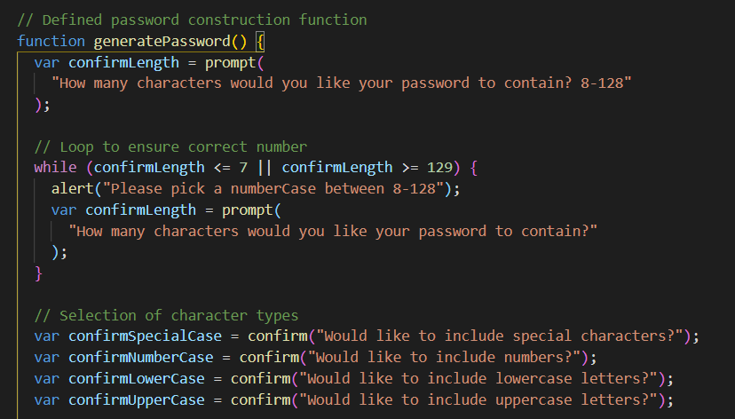
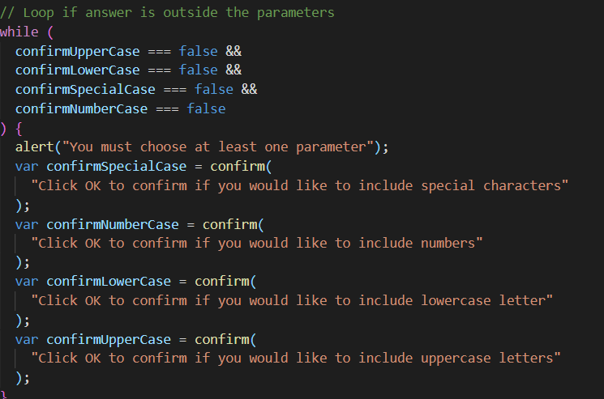
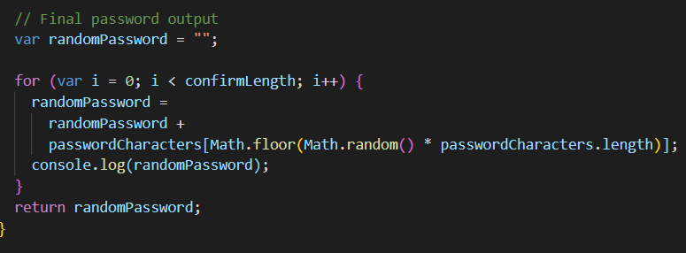
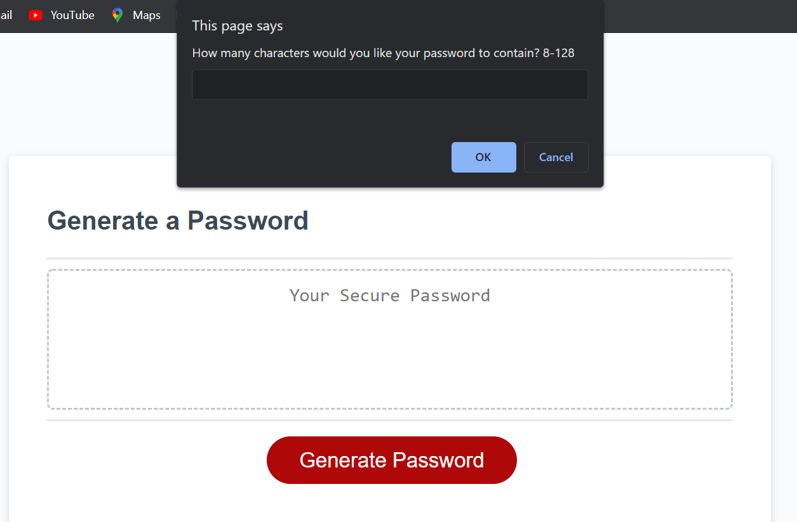
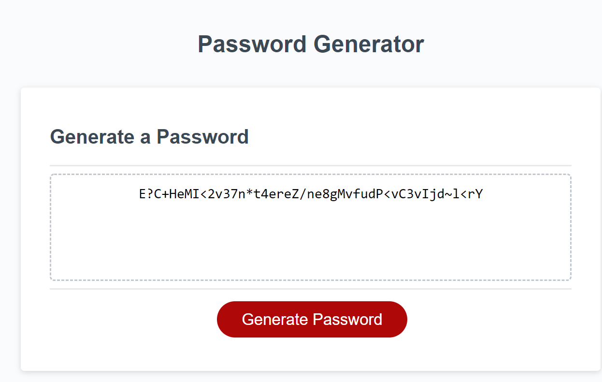

# 03 Java script: Password Generator (Explanation ReadMe)

Link to Website: https://crowderyan.github.io/Password-Generator/

1.  Password generator coding

    - A. Function of prompts and confirms to meet criteria:
      

          - A. Safeguards for set parameters:

      

          - C. For statement to build out password:

      

2.  Application running code:

